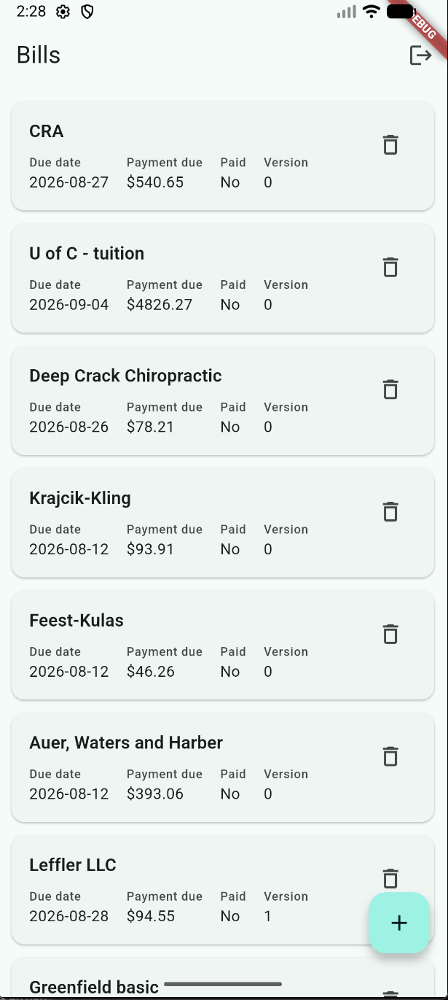
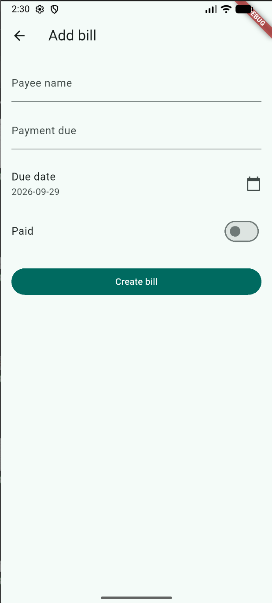
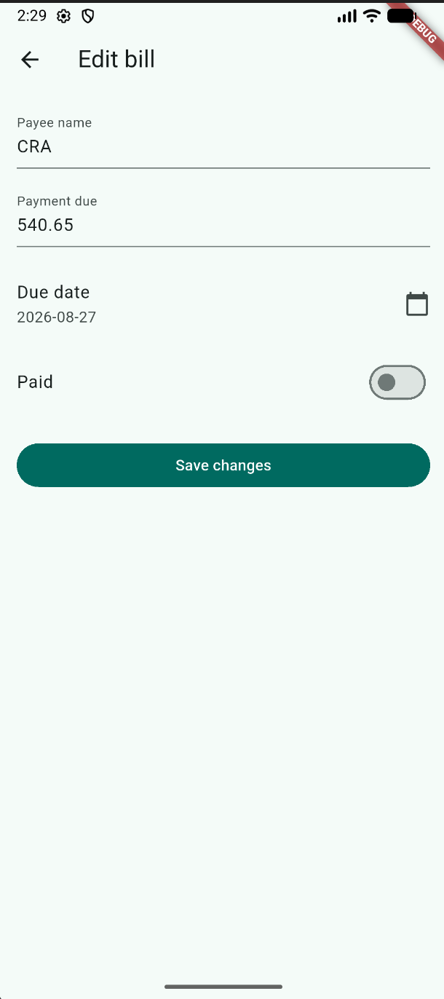
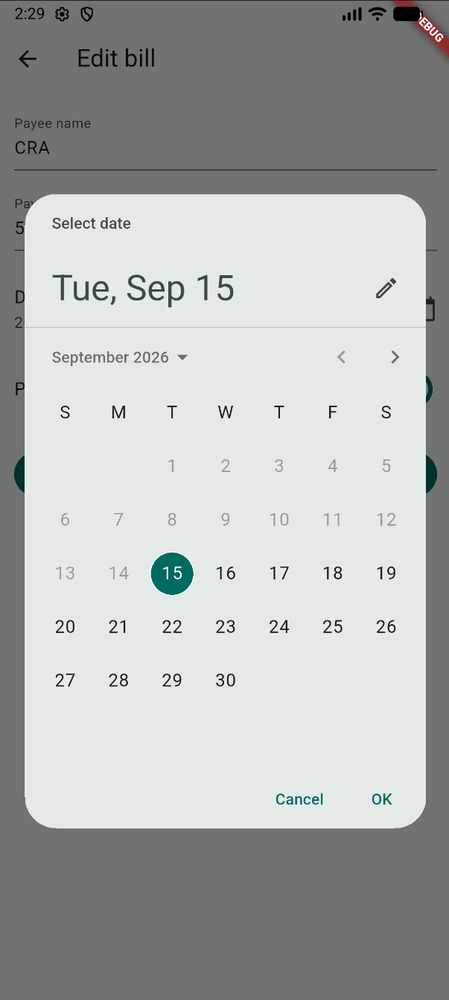

# Bill Manager

A full-stack bill tracking application with a Laravel REST API backend and a Flutter mobile client, secured with Keycloak and role-based access control. Built solo as a course project to research and implement an unfamiliar backend/frontend stack from the ground up.

> This is a cleaned, standalone copy of the original coursework repository, published as a portfolio piece. Environment values, credentials, and infrastructure-specific configuration have been stripped or replaced with placeholders.

## Screenshots

| Bill list | Create new bill |
|---|---|
|  |  |

| Edit bill | Date picker |
|---|---|
|  |  |

## Overview

Bill Manager lets a user track bills they owe: who they're payable to, the amount, the due date, and whether they've been paid. It started as a REST API contract-matching exercise and grew into a small secured, multi-user system over two project phases.

**Phase 1** built the core CRUD API and a Flutter client that could list, create, and edit bills against it.

**Phase 2** added authentication and authorization on top: every request now carries a JWT issued by Keycloak, the API verifies it and enforces role-based rules, and each user only sees their own bills.

## Tech stack

**Backend**
- Laravel 13 (PHP 8.4)
- Eloquent ORM, API Resources, Form Request validation
- `firebase/php-jwt` for JWT verification
- PostgreSQL 17

**Frontend**
- Flutter / Dart
- `StatefulWidget` + `FutureBuilder` for data loading (kept intentionally simple over a state management library, appropriate to the app's scope)

**Auth & infrastructure**
- Keycloak, federated to an LDAP directory for user accounts
- RS256 JWTs verified against Keycloak's JWKS endpoint, with local caching
- Two Keycloak clients: a confidential client for the Laravel backend, a public client for the Flutter app (the standard split between a server that can hold a secret and a mobile client that can't)
- Containerized services, run on a self-hosted VM

## How authentication and authorization work

1. The Flutter app posts credentials to Keycloak's token endpoint and receives back a JWT.
2. Every API request from the app includes that token in an `Authorization: Bearer` header.
3. A Laravel middleware layer verifies the token's signature against Keycloak's published JWKS, using RS256, before the request reaches any controller.
4. The token carries realm roles. The API uses those roles to branch behavior: a standard user manages their own bills, while a read/limited "Accounting"-style role can view but not create or delete.
5. Every bill is tied to an owner. The API filters queries by the authenticated user's ID, so one user's data is never visible to another regardless of role.
6. The Flutter UI mirrors the same rules client-side (hiding the create and delete controls for the restricted role), but the enforcement that actually matters happens server-side, not in the UI.

## Notable implementation details

- **Optimistic locking**: Laravel doesn't have a built-in equivalent to JPA's `@Version`, so update conflicts are handled with a manual version comparison, returning an HTTP 400 on mismatch rather than silently overwriting concurrent changes.
- **Ownership filtering**: rather than trusting a client-supplied user ID, the backend derives the owner from the verified JWT on every request.
- **Friendly error handling**: the Flutter API client wraps network and auth failures in custom exceptions with readable messages, instead of surfacing raw HTTP errors to the UI.

## Known limitations

- Date handling has a known edge case around server (UTC) vs. device local time in the date pickers; documented rather than fixed, given the project's scope.
- The app was built and tested against a self-hosted Keycloak/LDAP/Postgres stack and is not currently deployed anywhere publicly reachable, so there's no live demo link, just the screenshots above and the source here.

## What I'd do differently

Given more time, the next additions would be refresh-token handling (the current flow uses a single short-lived access token with no silent renewal) and moving the Flutter app off in-memory token storage to something durable across app restarts.

## Why these technologies

I wanted to work with PHP for reasons that were mostly curiosity and practical utility: it's a language I'd touched indirectly for years through WordPress work but never really learned properly. Laravel turned out to map well onto concepts I already knew from Django and JPA (Eloquent felt familiar coming from both), which made the ramp-up faster than expected. On the frontend, I stuck with Flutter over Astro or React because I already had real depth there from other projects, and I'd rather spend the limited project time on the unfamiliar backend than relearn a frontend framework at the same time.

## Getting started (local development)

This repo is published primarily as a code sample. It depends on a Keycloak realm, an LDAP-federated user directory, and a PostgreSQL database that aren't included here, so it isn't a one-command clone-and-run. At a high level:

```bash
# Backend
cd backend
composer install
cp .env.example .env      # fill in your own DB and Keycloak values
php artisan migrate
php artisan serve

# Frontend
cd frontend
flutter pub get
flutter run
```

You'll need your own Keycloak instance with a realm, a confidential client for the backend, and a public client for the Flutter app, along with a PostgreSQL database. Environment-specific values (hosts, client secrets, realm names) are intentionally not included in this repo.

## Author

Samuel Torres
